# Layoffs Data Cleaning & Exploratory Analysis
> SQL based project utilising MySQL to clean and analyze layoffs from companies in various industries between 2020 and 2023. I wrote queries and functions to perform data cleaning, processing, and analyzed different aspects of the layoff data.

## Data Cleaning
The steps to take:
1. Remove Duplicates
2. Standardise the Data
3. Null Values or blank values
4. Remove unnecessary/irrelevant Columns

```
-- Duplicate the table to prevent altering the original dataset from data manipulation
create table layoffs_staging
like layoffs;

insert layoffs_staging
select * from layoffs;

-- Remove Duplicates
-- To make sure, I'll be checking for duplicates
with duplicate_findings as
(
select *,
row_number() over(partition by company, industry, total_laid_off, percentage_laid_off, `date`, stage, country, funds_raised_millions) as row_num
from layoffs_staging
) select * from duplicate_findings where row_num > 1;

drop table layoffs_staging2;

-- Create similar table with duplicate identifier (row_num) as an extra fields
CREATE TABLE `layoffs_staging2` (
  `company` text,
  `location` text,
  `industry` text,
  `total_laid_off` int DEFAULT NULL,
  `percentage_laid_off` text,
  `date` text,
  `stage` text,
  `country` text,
  `funds_raised_millions` int DEFAULT NULL,
  `row_num` int DEFAULT NULL
) ENGINE=InnoDB DEFAULT CHARSET=utf8mb4 COLLATE=utf8mb4_0900_ai_ci;

insert layoffs_staging2
select *,
row_number() over(partition by company, industry, total_laid_off, percentage_laid_off, `date`, stage, country, funds_raised_millions) as row_num
from layoffs_staging;

delete from layoffs_staging2 where row_num > 1;
```
Now the duplicate row is removed from the newly created table

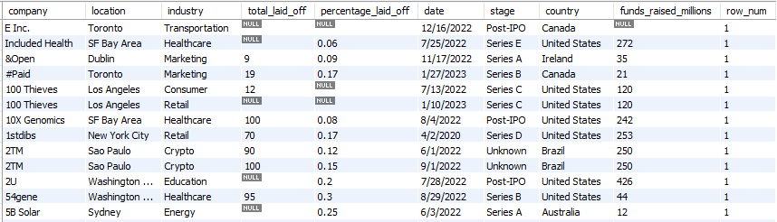

```
-- Standardise the Data
Select *
from layoffs_staging2;

-- Checking for whitespaces in 'company' field
select * from layoffs where company != trim(company);
-- trim those out
update layoffs_staging2 set company = trim(company);
```
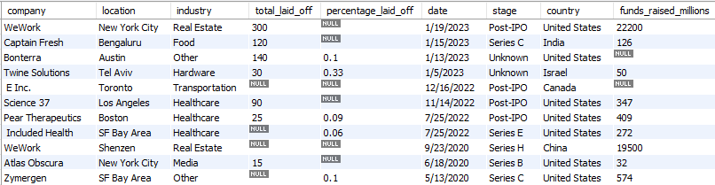

```
-- Checking 'industry' field
select distinct industry 
from layoffs_staging2 
order by 1;
-- it is found that Crypto Currency has 3 similar fields with bit different wording

-- So we find the most common ones
select industry, count(*) 
from layoffs_staging2 
group by industry 
having industry like '%Crypto%';
```
So the result is shown that 'Crypto' is the most common field

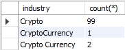

```
-- Update the lesser similar fields into 'Crypto'
update layoffs_staging2 
set industry = 'Crypto'
where industry like '%Crypto%';

-- Checking 'country' field
select distinct country from layoffs_staging2 order by 1
;
-- There are two United States fields, we will cut '.' away
update layoffs_staging2
set country = trim(trailing '.' from country)
where country like 'United States%';
```
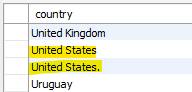

When sorted

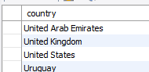

```
-- Convert 'date' field into date format
update layoffs_staging2
set `date` = str_to_date(`date`, '%m/%d/%Y');

alter table layoffs_staging2
modify column `date` date;
```
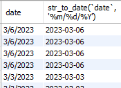

```
-- Null Values or blank values

-- Filling 'industry' field
select * from layoffs_staging2
where industry is null or industry = '';

-- first set empty cell into null for similarity
update layoffs_staging2
set industry = null
where industry = '';

select t1.company, t1.industry, t2.industry
from layoffs_staging2 t1
join layoffs_staging2 t2 
	on t1.company = t2.company
	and t1.location = t2.location
where (t1.industry is null or t1.industry = '')
and t2.industry is not null
;

-- We then update the null industry using the existing one with similar company name
update layoffs_staging2 t1
join layoffs_staging2 t2 
	on t1.company = t2.company
set t1.industry = t2.industry
where t1.industry is null
and t2.industry is not null;
```
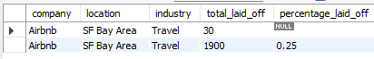

```
-- Remove unnecessary/irrelevant Columns
-- There are some company with no clear layoff numbers so it is doubtful whether there is any layoff at all
select * 
from layoffs_staging2
where total_laid_off is null 
and percentage_laid_off is null;

-- So we remove those rows
delete 
from layoffs_staging2 
where total_laid_off is null 
and percentage_laid_off is null;
```
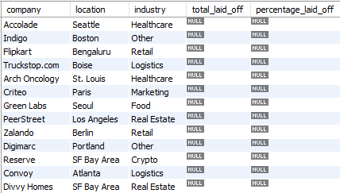

```
-- Lastly, remove row_num column
alter table layoffs_staging2
drop column row_num;

select * from layoffs_staging2
```

As a result, the original dataset is cleaned and stored in a duplicate named 'layoffs_staging2'.


We then use this cleaned dataset for further analysis.

## Exploratory Data Analysis
```
-- Checking data period
select min(`date`), max(`date`) from layoffs_staging2;
```
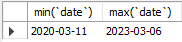

```
-- The companies that laid off all employees, likely closing down
select *
from layoffs_staging2
where percentage_laid_off = 1
order by funds_raised_millions desc;
```
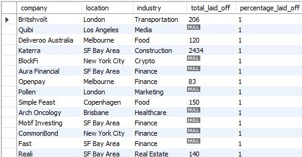

```
-- Companies with the highest number of layoff and their industries
select company, industry, sum(total_laid_off) as total_laid_off
from layoffs_staging2
group by company, industry
order by total_laid_off desc;
```
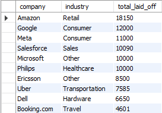

```
-- Industries with the highest number of layoff and their industries
select industry, sum(total_laid_off) as total_laid_off
from layoffs_staging2
group by industry
order by total_laid_off desc;
```
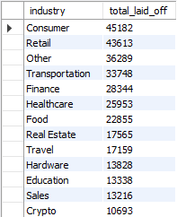

```
-- Year with the highest number of layoff and their industries
select year(`date`), sum(total_laid_off) as total_laid_off
from layoffs_staging2
group by 1
order by 2 desc;
```
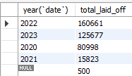

```
-- Stage of the company with the highest number of layoff and their industries
select stage, sum(total_laid_off) as total_laid_off
from layoffs_staging2
group by 1
order by 2 desc;
```
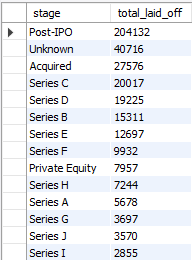

```
-- Explore layoff progression by month
with Rolling_Total as
(
select substring(`date`, 1, 7) as `month`, sum(total_laid_off) as total_laid_off
from layoffs_staging2
where substring(`date`, 1, 7) is not null
group by 1
order by 1 asc
)
select `month`, total_laid_off
, sum(total_laid_off) over(order by `month`) as rolling_laid_off
from Rolling_Total
;
```
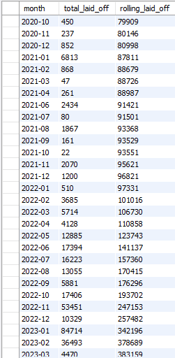

```
-- Top 5 company with most layoffs separated by years
with Company_Year (company, years, total_laid_off) as
(
select company, year(`date`), sum(total_laid_off)
from layoffs_staging2
group by company, year(`date`)
), 
Company_Year_Rank as (
select *, dense_rank() over(partition by years order by total_laid_off desc) as ranking
from Company_Year
where years is not null
)
select *
from Company_Year_Rank
where ranking <= 5;
```
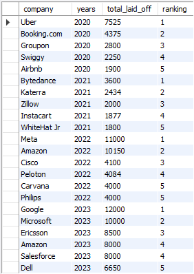


### Let's talk about some findings.
Companies with the Highest Number of Layoffs and Their Industries
* Big tech companies in various industries hold the highest number of layoffs. Notable examples include Amazon, Google, Meta, Salesforce, and Microsoft. This is likely due to the fast-paced nature of tech companies, which requires them to quickly adapt to changing global conditions.

Year with the Highest Number of Layoffs and Their Industries
* 2022 saw the highest number of layoffs, with 160,661 positions affected, followed by 2023 with 125,677 positions. These figures are significantly higher than other years, reflecting the economic impact of COVID-19 and the resulting new normal.

Layoff Progression by Month
* The table shows the peaks and valleys of layoffs throughout the period. Most layoffs occurred between mid-2022 and 2023, with January 2023 being the month with the highest number of layoffs.

Top 5 Companies with Most Layoffs Separated by Years
* The ranking helps us see which companies had to reduce their workforce the most each year. For instance, in 2022 and 2023, the top 5 companies with the most layoffs were predominantly in the tech industry.

